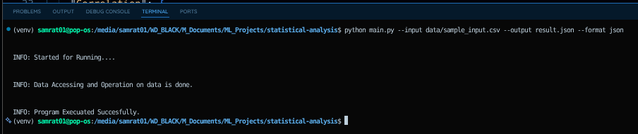
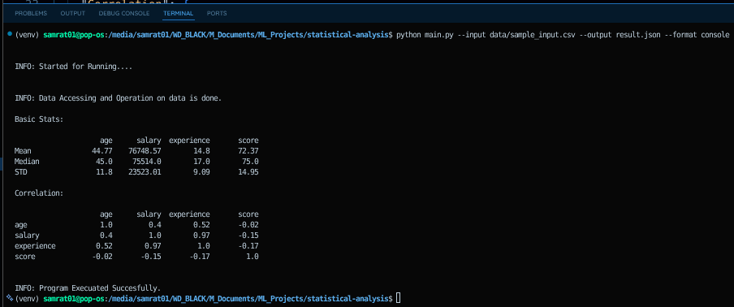
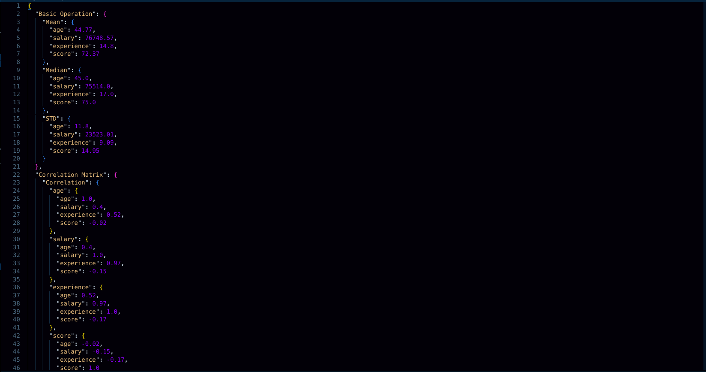

# 📊 Statistical Analysis Engine

<p align="center">
  <b>A professional CLI tool for statistical analysis using NumPy</b><br>
  Clean • Fast • Reliable • Built from scratch
</p>

<p align="center">
  
  
  
  
</p>

---

## 🚀 Overview

**Statistical Analysis Engine** is a powerful **Command Line Interface (CLI)** tool that computes:

- 📊 Descriptive Statistics (Mean, Median, Standard Deviation)
- 🔗 Correlation Matrix (Pearson)

Built using **pure NumPy**, this project focuses on:
- Understanding core statistical logic
- Avoiding high-level libraries (like SciPy)
- Writing clean, production-ready Python code

---

## ✨ Features

- ✅ Compute statistics **from scratch**
- ✅ Automatic handling of **multiple columns**
- ✅ Detect and stop on **invalid (non-numeric) data**
- ✅ Remove empty (NaN-only) columns
- ✅ Output in **console or JSON format**
- ✅ Clean CLI design using `argparse`
- ✅ Logging support for debugging

---

## 📸 Demo

### 🧾 CLI Command


### 📊 Console Output


### 🗂️ JSON Output


---

## ⚙️ Installation

```bash
git clone https://github.com/SamratGhimire01/statistical-analysis.git
cd statistical-analysis
````

```bash id="jhr8zk"
python3 -m venv venv
```

**Activate environment**

Linux/macOS:

```bash id="z40f6j"
source venv/bin/activate
```

Windows:

```bash id="k8xibw"
venv\Scripts\activate
```

```bash id="k8e2ww"
pip install -r requirements.txt
```

---

## ▶️ Usage

```bash id="5q9n1m"
python main.py --input data/sample_input.csv --output data/result_json.json --format json
```

---

## 🧠 CLI Arguments

| Argument   | Description                         |
| ---------- | ----------------------------------- |
| `--input`  | Required: Input CSV file            |
| `--output` | Output JSON path (default provided) |
| `--format` | `console` or `json`                 |

---

## 💡 Examples

```bash id="nt4x7p"
# JSON output
python main.py --input data.csv --output result.json --format json
```

```bash id="t3a3az"
# Console output
python main.py --input data.csv --format console
```

---

## 📊 Output Format

### Console

* Clean tabular display of:

  * Mean
  * Median
  * Standard Deviation
  * Correlation matrix

### JSON

```json id="rv6kpq"
{
  "Basic Operation": {
    "Mean": {},
    "Median": {},
    "STD": {}
  },
  "Correlation Matrix": {
    "Correlation": {}
  }
}
```

---

## 📐 Mathematical Logic

| Metric      | Formula               |
| ----------- | --------------------- |
| Mean        | μ = (1/n) Σ xᵢ        |
| Median      | Sorted middle value   |
| Std Dev     | σ = √(mean((x - μ)²)) |
| Correlation | `np.corrcoef()`       |

---

## ⚠️ Data Validation

* ❌ Stops execution if non-numeric values detected
* 🔍 Logs exact row & column of error
* 🧹 Removes empty (NaN-only) columns
* ✅ Ensures clean dataset before processing

---

## 🧪 Testing

```bash id="cc3p2r"
python3 -m pytest tests/test_stats.py
```

---

## 📁 Project Structure

```id="7s7rqp"
statistical-analysis/
├── main.py
├── src/
│   ├── cli.py
│   ├── loader.py
│   ├── stats.py
│   ├── reporter.py
│   └── log.py
├── tests/
├── data/
├── images/
└── README.md
```

---

## 🎯 Why This Project Matters

This project demonstrates:

* Strong understanding of **NumPy & statistics**
* Ability to build **real CLI tools**
* Writing **clean, modular, production-level code**
* Handling **edge cases & data validation**

👉 This is the type of project recruiters look for in:

* Data Analyst roles
* ML Engineer roles
* Backend Python roles

---

## 👨‍💻 Author

**Samrat Ghimire**  
🔗 GitHub: https://github.com/SamratGhimire01  
🔗 LinkedIn: https://www.linkedin.com/in/samratghimire01/  

---

## 📬 Contact Me

If you found this project helpful or want to collaborate, feel free to reach out!

👉 You can contact me through my portfolio website:  
🔗 https://samratghimire01.com.np/index.html#contact  

### 💡 What to include when reaching out:
- Full Name  
- Email  
- Phone Number  
- Your Message  

I’ll get back to you as soon as possible 🚀

---

<p align="center">
  ⭐ If you like this project, consider giving it a star!  
</p>